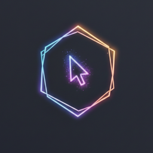

<p align="center">
  
</p>

<h1 align="center">CursorGlow</h1>

<p align="center">
  <strong>A neon cursor highlighter for macOS</strong><br>
  Make your cursor impossible to lose. Perfect for presentations, screencasts, and daily use.
</p>

<p align="center">
  <a href="https://github.com/Kerath2/CursorGlow/releases/latest"></a>
  
  
  
</p>

---

## About

CursorGlow adds a glowing neon ring around your cursor that follows it everywhere on screen. It features click animations, cursor-type detection, and a fully customizable appearance — all running as a lightweight menu bar app.

## Features

- **Neon Glow Highlight** — Vibrant border with inner glow, outer glow, and a blurred inner border for a depth effect
- **4 Shapes** — Circle, Squircle, Rounded Square, Rhombus
- **Click Animations** — Visual ripple on left/right click with a satisfying press effect
- **Cursor-Type Detection** — Automatically changes color when hovering over links (hand cursor) or text fields (I-beam cursor)
- **Auto-Hide** — Fades out when idle, reappears on movement
- **Keyboard Shortcut** — Toggle on/off with `Cmd + Shift + H`
- **Launch at Login** — Start automatically with your Mac
- **Restore Defaults** — One-click reset to the default neon palette
- **Menu Bar App** — Lives in your status bar, no Dock icon clutter

## Default Neon Palette

| Color | Hex | Use |
|:------|:----|:----|
| Cyan | `#00FFFF` | Highlight |
| Green | `#39FF14` | Hand cursor (links) |
| Purple | `#BF00FF` | Text cursor (I-beam) |
| Yellow | `#FFFF00` | Left click |
| Red | `#FF073A` | Right click |

All colors are fully customizable from Settings.

## Install

### Download (Recommended)

1. Download **CursorGlow.dmg** from the [latest release](https://github.com/Kerath2/CursorGlow/releases/latest)
2. Open the DMG and drag **CursorGlow** to **Applications**
3. Launch CursorGlow
4. Grant **Accessibility** permission when prompted (Settings > Behavior > Permissions)

### Build from Source

```bash
git clone git@github.com:Kerath2/CursorGlow.git
cd CursorGlow
xcodebuild -project CursorGlow.xcodeproj -scheme CursorGlow -configuration Release
```

Requires **Xcode 15+** and **macOS 13.0+**.

## Configuration

Open Settings with `Cmd + ,` or from the menu bar icon:

**Appearance**
- Shape, size, border width
- Highlight color and glow intensity
- Cursor-type colors (hand, I-beam)
- Click animation colors and border width
- Cursor offset adjustment

**Behavior**
- Launch at Login
- Click animation toggle
- Auto-hide delay
- Restore Defaults

## Requirements

- macOS 13.0 (Ventura) or later
- Accessibility permission (required for cursor tracking)

## Tech Stack

- Swift 5 / SwiftUI
- AppKit + Core Animation
- Accessibility API for cursor-type detection
- No third-party dependencies

## License

MIT

---

<p align="center">
  Built with neon vibes by <a href="https://github.com/Kerath2">Kerath2</a>
</p>
